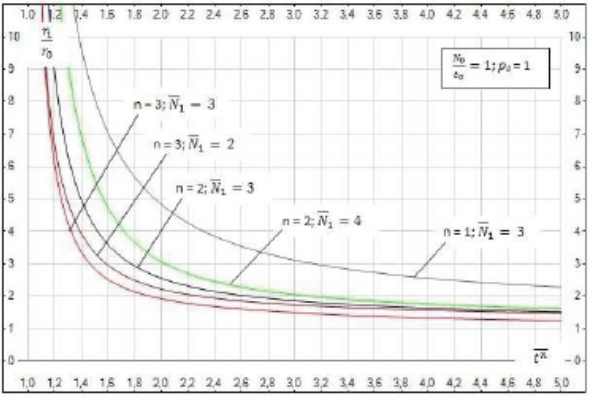

```{r setup, include=FALSE}
knitr::opts_chunk$set(echo = TRUE)
```


# Виды анализа и R markdown

Задание

1. Найдите примеры исследований, которые используют различные виды анализа данных. Нужно привести не менее одного примера на каждый тип анализа из вашего варианта, пример подкрепить ссылками на публикацию/статью, желательно с указанием DOI.

2. Обоснуйте почему выбранные вами исследования используют виды анализа из вашего варианта.

3. Результаты оформите с помощью R Markdown, который нужно будет скомпилировать в форматы PDF и HTML.

4. Итоговый документ должен содержать следующие элементы:

    + заголовки разных уровней

    + маркированные списки

    + нумерованные списки

    + URL-ссылки (укажите ссылку на репозиторий своего проекта на GitHub)

    + математические формулы в формате LaTeX

    + изображения

    + цитаты

    + таблицы

5. Файлы RMD, PDF и HTML опубликуйте в репозитории своего проекта на GitHub

## Прогностический анализ

Цель: использовать текущие и исторические данные, чтобы делать прогноза относительно будующих данных.

* Точность прогнозов зависит от измерения правильных переменных

* Множество способов построения моделей прогнозирования, некоторые из которых лучше или хуже для конкретных случаев

* Больше данных и простая модель обычно хорошо работают при прогнозировании будущих результатов

[Пример: “Исследование и моделирование цены на нефть” ISSN 2410-700X](https://cyberleninka.ru/article/n/issledovanie-i-modelirovanie-tseny-na-neft/viewer)

В данном исследовании построена однофакторная математическая модель, характеризующая зависимости цены нефти от двух факторов: ВВП России и индексом РТС на период с 2003 по 2013г. На основе эконометрического аппарата спрогнозированы тренды развития факторов в модели, на основании базовых из них осуществлён прогноз цены нефти.

Построение прогноза будущего на основе данных за предыдущие периоды является ключевым фактором прогностического анализа, к которому и относится часть данного исследования, другую же часть можно отнести к причинно-следственному анализу, потому что выявляется зависимость между ценой на нефть, ВВП России и Индексом РТС, дополнительно рассматривались факторы курс доллара и курс евро, однако корреляционный анализ выявил не значимость данных параметров, что, на мой взгляд, вполне логично, однако данной работе в качестве примера для данного вида анализа будет рассмотрена другая статья.

в исследовании, использовались следующие виды трендов:

* Полиномиальный, для прогнозирования влияния факторов ВВП России и Индекса РТС

* Степенной, для прогнозирования цены нефти

Получен проноз, при использовании степенного тренда, вычисляемого по формуле: \[y =28.113t^{0.5707}\]

|Год           | 2014| 2015  | 2016  |
|--------------|-----|-------|-------|
|Цена нефти, $ | 116 | 121.52| 126.77|

## Причинно-следственный анализ

Цель: посмотреть, что происходит с одной переменной, когда мы манипулируем другой переменной.

* Эталонный метод в анализе данных

* Часто применяется к результатам случайных исследований, которые были разработаны для выявления причинно-следственной связи.

* Обычно анализируются совокупности, а наблюдаемые взаимосвязи обычно являются средними эффектами

[Пример: “Причинно-следственный анализ стандартизации систем менеджмента качества организаций”](https://cyberleninka.ru/article/n/prichinno-sledstvennyy-analiz-standartizatsii-sistem-menedzhmenta-kachestva-organizatsiy/viewer)

В данном исследовании решается задача оптимизации распределения ресурсов между нормами. Развитие стандартизации в рамках организации рассматривается как совокупность тационарных и динамических процессов.

Изменения в организации, необходимые для интеграции новых требований по линейной и нелинейной (ускоренной) траектории, определяются следующим образом: \[\delta C_{i} = R *\partial N = r*S*\triangle N = r*\frac{p}{t}\partial(pt)\], Где p -показатель реализации нормативных требований в единицу времени, r – совокупные ресурсы организации на поддержку одного требования, S – способность организации к интеграции новых требований,  \(C_{i}\) – это возможности организации по интеграции новых требований, анализируемые по ресурсам в финансовом эквиваленте, человесеским ресурсам, показателю реализации нормативных требований.

>В результате исследования был представлены графики зависимости p на рис.1., которые позволяют определять и обосновывать необходимый темп развития стандартизации в организации. 

Таким образом рассматриваемая переменная в данном исследовании p - показатель реализации нормативных требований в единицу времени и рассматривается влияние остальных переменных на неё.


[Сылка на github](https://github.com/MikhailOznobikhin/Rmarkdown)
